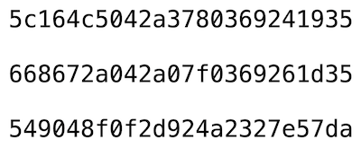
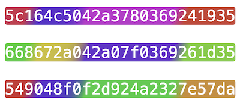
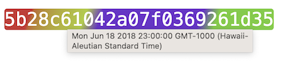
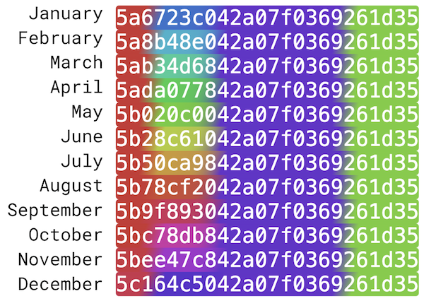

# CandyCaneId

Chrome extension for making ObjectIds more identifiable.

[Chrome Web Store](https://chrome.google.com/webstore/detail/candycaneid/lnfhmkedfilblpkjlaophjdpkldnfjap)

## 🍬 How It Works

This extension searches the page for
any [MongoDB ObjectId](https://www.mongodb.com/docs/manual/reference/method/ObjectId/) strings and
colorizes them in a way that is more distinguishable and actually conveys some useful information.

As plain hexadecimal strings, ObjectId values tend to all look the same which makes it easy to
confuse them with each other and more difficult to remember them over time.

By visualizing ObjectIds as uniquely colored blocks they suddenly become recognizable entities. It
is immediately obvious when two ObjectIds are the same or different. And commonly seen ObjectIds are
more memorable and familiar. Anecdotally, the vividness of the colors also contributes as well. If a
color pattern is particularly interesting or appealing or weird, the emotion it evokes can make it
more memorable.

## 🍭 Features

### 🕛 View the Creation Date

With this extension installed, you can hover over any ObjectId to see when it was originally
created (in your browser's timezone).

### 📊 Colorization as Data Visualization

In addition to being more recognizable, the colors themselves also convey a small amount of
information.
Since [ObjectIds have a structure of 3 parts](https://www.mongodb.com/docs/manual/reference/method/ObjectId/)
, these parts are used as the basis for the bands of color.

#### 🕐 Part 1: Creation Date

The first 4 bytes of an ObjectId encode the timestamp when it was originally created. This
information is used to create 2 bands of color at the front of the ObjectId:

##### ⏳ Age

The left-most tip is colored based on the **age** of the ObjectId. By default, recently created
ObjectIds will have a green tip. Older ObjectIds will be more blue, then purple, then red once an
ObjectId is 5 years old or more.

##### ❄️ Season

The second band of color represents the time of year or **season** when the ObjectId was created.
This is done by taking the time within the given year of creation and modulating it over the color
wheel. By default, the colors are mapped such that winter looks purple/blue, spring looks green, summer
looks yellow/orange, and fall looks red/magenta.

#### 🤖 Part 2: Machine/Process

The middle 5 bytes of an ObjectId are a random and unique value representing the **machine** and
process that created it. This is simply hashed and modulated over the color wheel to select a color.
This means that ObjectIds created by the same process will have the exact same color in the middle.
Not terribly useful, but mildly interesting.

#### 💯 Part 3: Counter

The last 3 bytes of an ObjectId are a just an incrementing **counter** to ensure uniqueness when the
same process generates multiple ObjectIds within the same second. Again, this is simply hashed and
modulated over the color wheel to select a color. This counter doesn't really convey any information
so neither does the color.

### ⚙️ Settings

Click on the extension icon to adjust the settings to your liking:

- Toggle the **Enabled** checkbox to turn the colorization on/off
- Use **Saturation** and **Lightness** sliders to adjust the intensity of the colors
- Use **Hue Offset** sliders to shift the hue spectrum for each band of color.
    - NOTE: Moving the **Age** or **Season** sliders will disrupt the documented and meticulously
      hand-crafted color mapping, but you do you.
- _(experimental)_ Toggle the **Colorblind Mode** checkbox to slightly increase the contrast between
  colors and switch to a more limited palette of hues.
- Double-click on the **CandyCaneId** title to factory reset the extension

## 💾 Install

[Chrome Web Store](https://chrome.google.com/webstore/detail/candycaneid/lnfhmkedfilblpkjlaophjdpkldnfjap)

### Manual

1. Download repo
2. Go to chrome://extensions/
3. Enable "Developer Mode"
4. Click "Load unpacked"
5. Select src directory
6. Pin extension

## ⚠️ Limitations

- Colorblind Mode is experimental and has no evidence that it actually helps yet. More testing and
  research is required to implement this properly.
- With only 4 colors it's more than possible for there to be collisions or colorizations that only
  differ by very subtle hues. You can be sure that if a colorized ObjectId looks different then it
  is different, but always good to double check that similar looking ones are actually the same.
- This extension does make changes to the DOM, which might have unintended side effects.
- This extension will only colorize ObjectId values that appear as plain text nodes in the DOM, so
  values that are displayed using some other means (e.g. CSS content property) will not be
  processed.
- This extension might not notice ObjectIds that are loaded into the page asynchronously in a way
  that doesn't involve a DOM change.
- If the extension seems to be misbehaving, try double-clicking on the "CandyCaneId" title in the
  extension dropdown to factory reset it.

## ❓ FAQ

- Why 4 colors?
    - I originally started with 3, one per section of the ObjectId, and then threw in the age color
      on the tip. In testing, I felt like 3 colors made it too easy for collisions to happen. But I
      also wanted to keep the number of bands as small as possible under the assumption that this
      would make a particular color pattern easier to recognize and remember. I also liked the idea
      of the color bands correlating with the actual structure of the ObjectId. That said, it would
      be interesting to experiment with different colors/patterns to see what is most
      distinguishable.
- Why not replace the ObjectId text itself with something even more memorable, like a short word or
  phrase?
    - Since ObjectIds can appear in many places where this extension can't reach (e.g. local files,
      Slack or other programs), I felt it was important that the actual hexadecimal text of the
      ObjectId remain intact so it can still be compared outside the browser. Otherwise this would
      only add confusion.
- What's the point of the Hue Offset settings?
    - I don't know, I just threw them in there because they look fun. I suppose if there was one
      ObjectId in particular that was your favorite, you could shift the sliders so that that
      specific ObjectId has the colorization you want (e.g. all red). But you could only do that
      for that one ObjectId.

## 💡 Inspirations

- https://github.com/PeaSeaGee/roids
- https://www.youtube.com/watch?v=NxsaHxON350&t=504s
